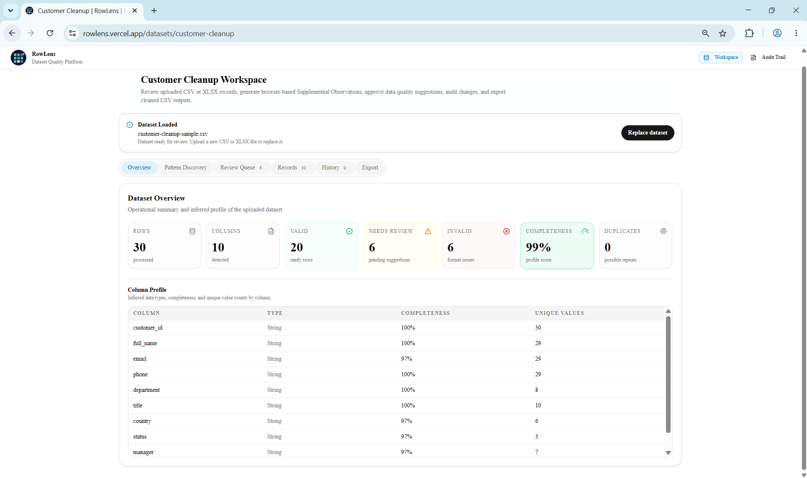
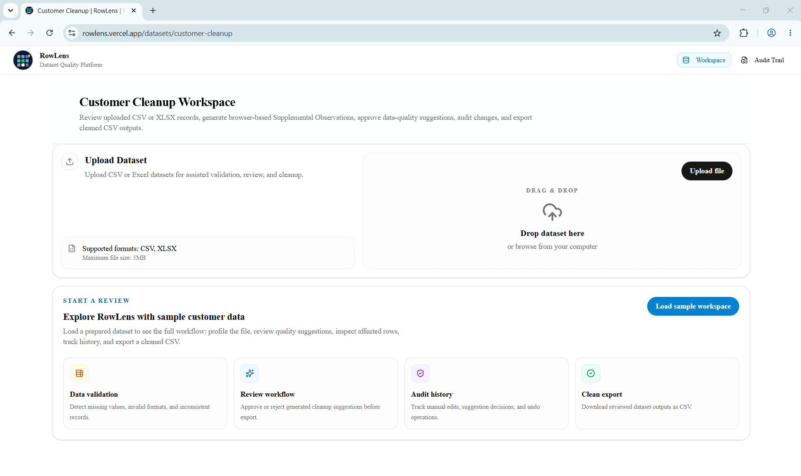
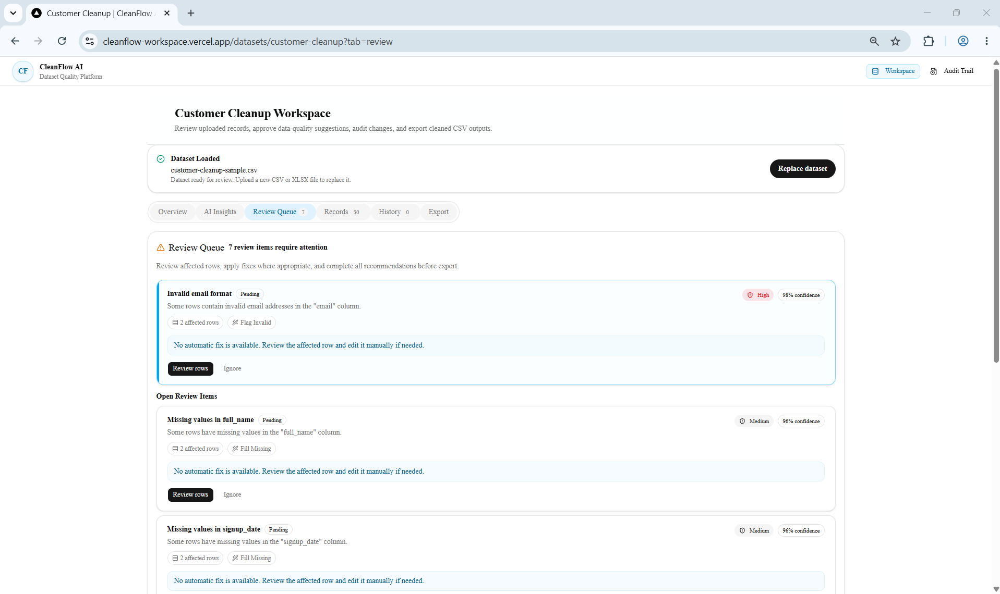
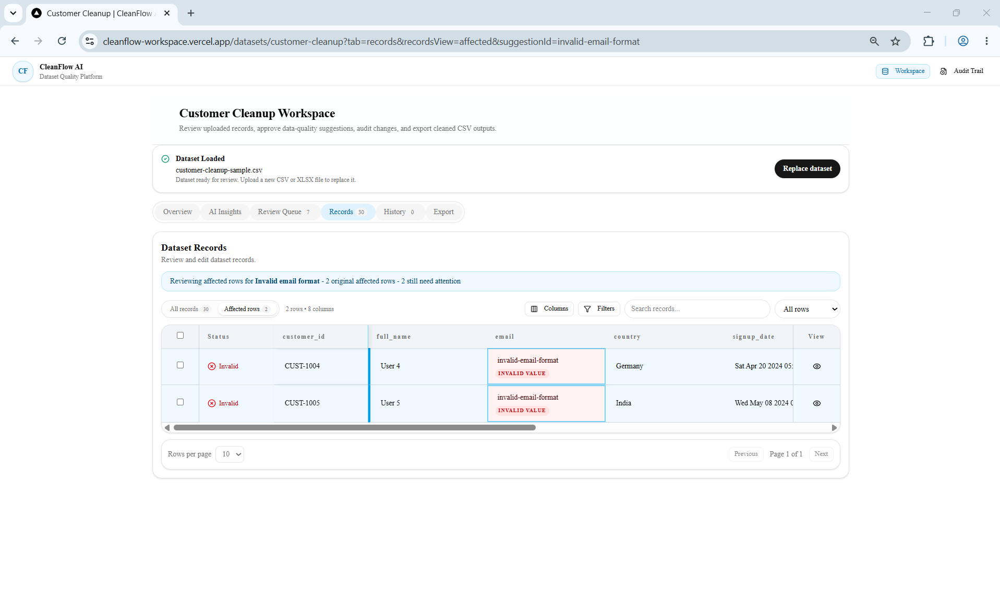
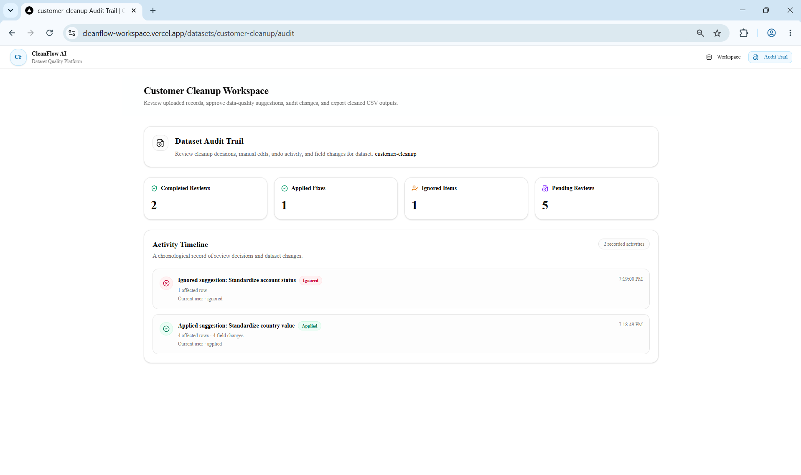

# RowLens


> Browser-first dataset review workspace built with Next.js, React, TypeScript, and optional on-device AI analysis powered by WebLLM.

RowLens is a frontend-focused data quality and review platform that allows users to upload datasets, identify issues, review suggested fixes, track changes, and export cleaned data.

The project was built as a portfolio-grade application to demonstrate senior frontend engineering practices across state management, data-intensive UI design, browser performance, workflow orchestration, local AI integration, and maintainable application architecture.

---

# What This Demonstrates

RowLens was built to showcase frontend engineering skills commonly required in modern enterprise platforms:

- React and TypeScript application architecture
- Data-intensive user interfaces
- Micro-interaction and workflow design
- Browser performance optimization
- State management at scale
- AI-assisted user experiences
- Auditability and traceability
- Maintainable feature-oriented architecture

Many of these patterns are commonly found in internal platforms, operational systems, analytics tools, and enterprise workflow applications.

---

# Portfolio Highlights

- Built a browser-first dataset review workspace using Next.js, React, and TypeScript
- Dynamic schema generation from CSV and XLSX uploads
- Reducer-driven workflow state with audit history and undo support
- Browser-based dataset parsing and on-device AI analysis
- Optional on-device Pattern Discovery powered by WebLLM and WebGPU
- Deterministic validation remains the source of truth, while optional Browser AI provides supplemental observations.
- Repository and adapter architecture enabling replaceable infrastructure boundaries
- Route-scoped workspaces with isolated persistence

---

# Screenshots

## Workspace Overview

The primary dataset review workspace showing dataset profiling, validation metrics,
review readiness, and workflow status.



---

## Dataset Upload

Upload CSV or XLSX files or load a sample workspace to explore the review workflow.

Supported file formats:

* CSV
* XLSX



---

## Review Queue

Review detected data quality issues, severity levels, confidence scores, and
recommended actions before approving changes.



---

## Records Investigation

Navigate directly to affected rows and investigate validation issues in context.



---

## Audit Trail

Track review decisions, applied fixes, ignored suggestions, timestamps, and
workflow history.



---

## Live Demo

Explore the deployed application:

**https://rowlens.vercel.app**

Load the included sample dataset to explore the complete review workflow.

The demo includes a sample dataset that showcases:

- Dataset profiling
- Deterministic validation
- Review workflows
- Manual editing
- Audit history
- Export
- Browser AI Pattern Discovery (supported devices only)

---

## Browser AI Requirements

Pattern Discovery uses a local WebLLM model that is loaded on demand when the feature is invoked.

For the best experience, your browser should support:

- WebGPU
- A modern Chromium-based browser (such as Chrome or Microsoft Edge)
- Sufficient GPU memory to load the selected local model

The initial model download may take some time depending on your connection because the model is loaded into the browser on first use.

If Browser AI is unavailable, model loading fails, or inference times out, RowLens automatically falls back to deterministic validation. Dataset upload, validation, review workflows, editing, auditing, and export remain fully functional without AI.

## Exploring the Demo

The fastest way to explore RowLens is to open the deployed application and load the included sample dataset.

Suggested walkthrough:

1. Load the sample dataset.
2. Review the detected validation issues.
3. Open the Review Queue.
4. Navigate to affected rows.
5. Apply or ignore suggested fixes.
6. Make a manual edit.
7. Review the transformation history and audit trail.
8. Export the cleaned dataset.
9. Optionally run Pattern Discovery on supported devices.

This walkthrough demonstrates the complete review workflow without requiring your own dataset.

---

# Why This Project Exists

Most data quality tools focus heavily on backend processing.

RowLens explores the frontend engineering challenges involved in reviewing and correcting datasets:

* Dynamic data schemas
* Large table interactions
* Workflow state orchestration
* Auditability and traceability
* Browser performance constraints
* AI-assisted review experiences
* Local-first architecture

The goal is not to build a complete SaaS platform but to demonstrate how a production-quality frontend could support these workflows.

---

## Current Constraints

RowLens is intentionally scoped as a browser-first frontend application.

Current implementation constraints include:

- Uploads are intentionally limited to 5 MB and approximately 5,000 rows to maintain responsive browser performance.
- XLSX parsing currently imports the first worksheet only.
- Built-in validation currently focuses on common data quality issues such as missing values, invalid email formats, invalid date-like values, and value standardization.
- Browser AI analyzes a capped sample of dataset rows to balance responsiveness and resource usage.
- Local draft persistence uses browser storage and is intended for single-user workflows.

## Local-First & Privacy

RowLens processes datasets entirely within the browser.

The current implementation:

- Parses CSV and XLSX files locally.
- Executes AI analysis locally through WebLLM when available.
- Stores workflow drafts in browser localStorage.
- Does not upload datasets or AI prompts to a backend service.
- Does not require user accounts or external AI APIs.

No uploaded dataset leaves the user's browser in the current implementation.

Workflow drafts are stored in browser localStorage for a local-first experience. Because browser storage is not intended for sensitive production data, it should not be considered a secure persistence mechanism.

---

# Engineering Focus

This project was intentionally designed to demonstrate frontend engineering challenges commonly found in enterprise applications:

* Data-intensive table workflows
* Dynamic schema rendering
* Reducer-based workflow orchestration
* Browser-based file processing
* Local-first persistence architecture
* Route-scoped workspaces
* AI-assisted user experiences
* Audit and change tracking
* Browser performance boundaries
* Replaceable infrastructure adapters

The project emphasizes maintainability, scalability, and explicit state management rather than backend infrastructure.

---

# Architecture Principles

The application was designed around a few core principles:

- Explicit state transitions over implicit component mutations
- Clear separation between workflow, table, persistence, and AI concerns
- Browser performance through constrained local processing
- Deterministic validation as the source of truth
- Replaceable infrastructure boundaries through adapters and repositories
- Local-first development without backend dependencies

---

# Key Features

### Dataset Upload

* Upload CSV and XLSX files
* File size validation
* Row count validation
* Sample dataset support
* Dynamic schema generation

### Data Quality Review

* Missing value detection
* Invalid email detection
* Invalid date detection
* Review queue generation
* Row highlighting

### Records Workspace

* Search
* Filtering
* Sorting
* Pagination
* Row selection
* Column visibility controls
* Column pinning
* Inline editing

### Review Workflow

* Review suggestions
* Apply fixes
* Ignore suggestions
* Mark records reviewed
* Navigate directly to affected rows

### Audit & History

* Transformation history
* Field-level change tracking
* Undo support
* Conflict detection
* Audit trail route

### Export

* Export current dataset
* Export selected rows
* CSV generation
* Formula injection protection

### Browser AI

* Local WebLLM execution
* WebGPU acceleration
* AI-assisted review findings
* Deterministic fallback mode
* No external AI API required

## Project Structure

The codebase follows a feature-oriented architecture.

```text
src/
  app/
  components/
  features/
    ai/
    datasets/
  hooks/
  lib/
  types/
  workers/
```

# Technology Stack

### Framework

* Next.js 16
* React 19
* TypeScript

### UI

* Tailwind CSS
* Radix UI
* shadcn/ui
* Lucide Icons

### Data Processing

* React Dropzone
* Browser-based dataset processing

### Browser AI

* WebLLM
* WebGPU

### Quality

* ESLint
* Vitest
* Testing Library
* jsdom

---

# Routes

| Route                         | Purpose                      |
| ----------------------------- | ---------------------------- |
| `/`                           | Redirects to default dataset |
| `/datasets`                   | Dataset entry point          |
| `/datasets/customer-cleanup`  | Customer cleanup workspace   |
| `/datasets/sales-audit`       | Sales audit workspace        |
| `/datasets/marketing-leads`   | Marketing leads workspace    |
| `/datasets/[datasetId]/audit` | Dataset audit history        |

Each workspace maintains separate local persistence and audit history.

---

# Architecture Overview

```text
Next.js Route
      |
      v
Dataset Workspace Container
      |
      +-------------------------+
      |                         |
      v                         v
Workflow Reducer         Table State
      |                         |
      v                         v
Validation Engine      Query Adapter
      |
      v
Suggestions
      |
      v
Review Queue
      |
      v
Transformations
      |
      v
Audit Trail
      |
      v
Local Storage Repository

Browser AI
      |
      v
WebLLM Engine
      |
      v
AI Findings
      |
      v
Review Queue
```

The application follows a feature-oriented architecture where routes remain thin and business logic is organized into dedicated features, hooks, reducers, utilities, repositories, and adapters.

---

# State Management

The application intentionally avoids global state libraries.

Workflow state is managed through:

```text
useReducer
      |
      v
workflowReducer
      |
      v
Dataset Workflow State
```

The reducer controls:

* Upload lifecycle
* Dataset records
* Suggestions
* Transformations
* Audit events
* Review state
* AI findings

Table state is separated into dedicated hooks to avoid coupling workflow logic with UI interactions.

---

# Data Flow

```text
Upload File
      |
      v
Dataset Parsing
      |
      v
Validation
      |
      v
Dataset Profile
      |
      v
Suggestions
      |
      v
Review Workflow
      |
      v
Transformations
      |
      v
Audit Events
      |
      v
Export
```

Workflow changes are persisted locally and can be restored when revisiting a dataset workspace.

---

# AI Approach

RowLens separates deterministic validation from AI-generated observations.

## Deterministic Validation

Source of truth for:

* Missing values
* Invalid emails
* Invalid dates
* Review queue generation

## Optional Browser AI

On supported devices:

* Loads a local WebLLM model
* Executes entirely in the browser
* Uses WebGPU acceleration
* Analyzes a capped sample of dataset rows
* Produces supplemental data quality observations

The model is explicitly instructed not to invent validation issues and cannot override deterministic findings. AI findings are advisory only. They never modify dataset records directly and must be explicitly accepted before entering the review workflow.

## Fallback Mode

If:

* WebGPU is unavailable
* Model loading fails
* AI generation times out

the application continues functioning with deterministic insights only.

No external AI API is configured in this repository.

---

# Performance Considerations

### Browser-Based Processing

CSV and XLSX parsing execute entirely in the browser with upload constraints
designed to keep processing responsive for portfolio-scale datasets.

### Browser AI Execution

Browser AI inference executes locally using WebGPU acceleration when available.
Dataset sampling, prompt size limits, and chunked analysis help keep local inference responsive on supported devices.

### Local Query Adapter

Filtering and sorting are isolated behind query adapter boundaries to allow future replacement with server-side implementations.

### Constrained AI Analysis

AI analysis operates on a capped sample of dataset rows to balance responsiveness, browser memory usage, and inference latency.

---

# Engineering Highlights

### Explicit Workflow Model

Workflow transitions are represented as reducer actions rather than scattered component state.

### Adapter Boundaries

Parsing, querying, persistence, and AI integrations are abstracted behind interfaces that can be replaced without changing the UI layer.

### Auditability

Transformations retain field-level before/after values and support safe undo operations.

### Local-First Architecture

Persistence is intentionally browser-local while maintaining clean repository boundaries for future server implementations.

### Route-Scoped Workspaces

Each dataset workspace maintains independent state and persistence.

---

# Engineering Decisions & Tradeoffs

### Reducer-Owned Workflow State

Dataset lifecycle transitions—including uploading, processing, review actions, edits, undo operations, audit events, and restoration—are centralized within a dedicated workflow reducer. This makes state transitions explicit, testable, and easier to reason about. The tradeoff is additional domain-model complexity compared with isolated component state.

### Separate Workflow, Table, and Preference State

Workflow state, table interactions, and user preferences are managed independently through dedicated hooks and adapters. This prevents a single oversized state model and keeps responsibilities clear, though it requires coordination between workflow and table layers.

### Route-Scoped Workspaces

Dataset identity is derived from route parameters (`/datasets/[datasetId]`), allowing each workspace to maintain independent state and browser persistence. This makes ownership boundaries explicit, with the tradeoff that the current dataset registry is static rather than server-driven.

### Browser-Based Dataset Processing

Dataset parsing executes entirely in the browser. Uploads are intentionally constrained to 5 MB and 5,000 rows to maintain responsiveness and predictable performance for a browser-first workflow.

### Deterministic Validation as the Source of Truth

Validation logic for missing values and invalid email/date-like fields is deterministic and local. This keeps record status and review workflows predictable. The tradeoff is narrower validation coverage compared with domain-specific or server-side validation systems.

### Browser AI as Supplemental Guidance

WebLLM runs a local WebGPU model directly in the browser to generate higher-level observations. Deterministic validation remains authoritative, and AI findings must be explicitly added to the Review Queue.

### Graceful AI Fallback

When WebGPU is unavailable or model execution fails, the application falls back to deterministic insights rather than blocking the review workflow. This preserves usability but limits discovery to existing validation evidence.

### Repository and Adapter Boundaries

Parsing, persistence, and query operations are expressed through adapters and repository abstractions. Current implementations use browser-based processing, localStorage, and in-memory queries. The additional abstraction introduces some complexity today but creates clear replacement seams for server-backed implementations later.

### Local Draft Persistence

Workflow drafts are restored from localStorage and normalized during reload. This supports a realistic local-first experience without requiring backend infrastructure. The tradeoff is that browser storage is not suitable for collaboration, durable audit requirements, or sensitive production datasets.

### Audit History and Safe Undo

Transformations retain field-level before-and-after values. Undo operations only revert values that still match the recorded post-change state, preventing accidental overwrites of newer edits. This favors data integrity over simplistic rollback behavior.

### Paginated Data Grid

The table supports dynamic schemas, search, filtering, sorting, selection, column pinning, inline editing, and pagination through a local query adapter. Virtualization is intentionally deferred because current upload constraints keep datasets within manageable limits.

### Client-Side Export Safety

CSV exports reflect the current workflow state and apply formula-injection mitigation by prefixing formula-like values. This is a practical browser-only safeguard, though production systems would typically add authorization, logging, and server-side export controls.

---

# Testing

```bash
npm run lint
npm run build
npm run test:run
```

Automated tests cover both domain logic and UI behavior:

* Workflow reducer behavior
* Dataset parsing
* Validation logic
* Suggestion application
* Table state management
* Workflow restoration and persistence
* Review workflow lifecycle
* Manual editing and undo behavior
* Browser AI helpers
* UI state transitions

---

# Local Setup

## Prerequisites

* Node.js
* npm

## Installation

```bash
npm install
```

## Development

```bash
npm run dev
```

Open the application:

```text
http://localhost:3000
```

---

# Available Scripts

| Command          | Purpose                 |
| ---------------- | ----------------------- |
| npm run dev      | Development server      |
| npm run build    | Production build        |
| npm run start    | Start production build  |
| npm run lint     | Run ESLint              |
| npm run test     | Run tests in watch mode |
| npm run test:run | Run tests once          |

---

# Design Boundaries

RowLens is intentionally designed as a browser-first frontend application.

The project focuses on:

- Dataset review workflows
- Data-intensive UI patterns
- State management
- Browser-based processing
- Browser AI inference
- Auditability and change tracking

Backend services, authentication, collaboration features, and server-side persistence were intentionally excluded to keep the project focused on frontend architecture and user experience design.

---

## Future Enhancements

RowLens was intentionally scoped as a frontend-focused application. Potential future extensions include:

- Server-backed workspace persistence
- Authentication and role-based access
- Collaborative review workflows
- Configurable validation rules
- Domain-specific validation plugins
- Pluggable AI providers
- Background dataset processing
- Additional export formats

---

# Engineering Challenges Addressed

- Dynamic schema rendering from arbitrary uploaded datasets
- Maintaining responsive UI during file parsing and AI analysis
- Coordinating workflow, table, audit, and AI state without global state libraries
- Preserving auditability while supporting undo operations
- Separating deterministic validation from probabilistic AI guidance
- Designing extensible repository and adapter boundaries for future infrastructure replacements

---

# License

# License

Copyright © 2026 Steffi Kavalakat.

This repository is published for portfolio and technical evaluation purposes.

The source code may be viewed for learning and hiring evaluation but may not be copied, redistributed, modified, or used in other projects without prior written permission.

See the LICENSE file for details.
